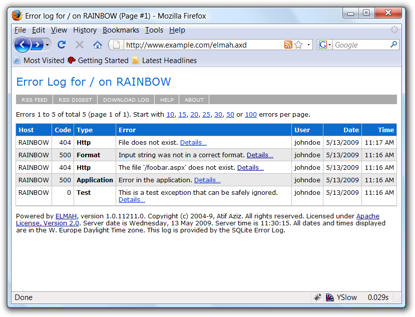

ELMAH (Error Logging Modules and Handlers) is an application-wide error logging facility that is completely pluggable. It can be dynamically added to a running [ASP.NET](http://www.asp.net/) web application, or even all ASP.NET web applications on a machine, without any need for re-compilation or re-deployment.

Once ELMAH has been dropped into a running web application and configured appropriately, you get the following facilities without changing a single line of your code:

  * Logging of nearly all unhandled exceptions.
  * A web page to remotely view the entire log of recoded exceptions.
  * A web page to remotely view the full details of any one logged exception, including colored stack traces.
  * In many cases, you can review the original [yellow screen of death](http://en.wikipedia.org/wiki/Yellow_Screen_of_Death#ASP.NET) that ASP.NET generated for a given exception, even with `customErrors` mode turned off.
  * An e-mail notification of each error at the time it occurs.
  * An RSS feed of the last 15 errors from the log.

  <h5>ELMAH 1.2 Service Pack (SP) 2 <a href="https://code.google.com/p/elmah/wiki/Downloads?tm=2">now available</a></h5>
  
See also:

  
  <ul>
    <li><a href="http://code.google.com/p/elmah/issues/list?q=label%3AMilestone-Release1.2&amp;can=1">What’s new and fixed in 1.2</a></li>
    <li><a href="http://code.google.com/p/elmah/issues/list?q=label%3AMilestone-Release1.2SP1&amp;can=1">What’s fixed in 1.2 SP1</a></li>
    <li><a href="http://code.google.com/p/elmah/issues/list?q=label%3AMilestone-Release1.2SP2&amp;can=1">What’s fixed in 1.2 SP2</a></li>
  </ul>

## More Features

  * Log errors to several back-end storages:
    * [Microsoft SQL Server](http://www.microsoft.com/sql/)
    * [Oracle](http://www.oracle.com/) ([OracleErrorLog](http://elmah.googlecode.com/svn/tags/REL-1.2/src/Elmah/OracleErrorLog.cs))
    * [SQLite](http://www.sqlite.org/) (version 3) database file
    * [Access Microsoft Access] ([AccessErrorLog](http://elmah.googlecode.com/svn/tags/REL-1.2/src/Elmah/AccessErrorLog.cs))
    * <del>[VistaDB](http://www.vistadb.net/) ([VistaDBErrorLog](http://elmah.googlecode.com/svn/tags/REL-1.1/src/Elmah/VistaDBErrorLog.cs))</del>; deprecated in release 1.2
    * Loose XML files
    * RAM (in-memory)
    * [SQL Server Compact Edition](http://www.microsoft.com/sql/)
    * [MySQL](http://www.mysql.com/)
    * [PostgreSQL](http://www.postgresql.org/)
  * Supports ASP.NET 1.x, 2.0 and later versions.
  * Supports medium trust under ASP.NET 2.0 and later versions.
  * [Filter unwanted exceptions](http://code.google.com/p/elmah/wiki/ErrorFiltering), programmatically and via configuration.
  * Get a digest RSS feed that lists errors by day and up to last 15 days.
  * Programmatically and explicitly signal exceptions that, although handled in some way, should still be logged.
  * Download the whole error log into a single CSV file for analysis, filtering and charting using [Microsoft Excel](http://www.microsoft.com/excel/) or [Microsoft Log Parser](http://www.microsoft.com/technet/scriptcenter/tools/logparser/default.mspx).
  * Send error notifications/tweets to your [iPhone, iPad or a custom application](http://code.google.com/p/elmah/wiki/ProwlingErrors).
  * Access the raw XML behind any logged error from its details page, making it easier to get to information (like form data, including [View State](http://msdn2.microsoft.com/en-us/library/ms972976.aspx)) that, until now, had to be grabbed directly out of the error log's backing store.
  * Supports ASP.NET web application root operator (`~`) in paths for file-based error log implementations.
  * Check if any ELMAH installation is up to date through its _about page_.
  * Run a self-contained demo Web site showing error logging and mailing in action right out of the box. Run [demo.cmd](http://elmah.googlecode.com/svn/tags/REL-1.2/demo.cmd) in the root of the distribution.
  * Use `MsAjaxDeltaErrorLogModule` to log errors during partial updates enabled by [UpdatePanel](http://msdn.microsoft.com/en-us/library/system.web.ui.updatepanel.aspx) in Microsoft ASP.NET AJAX
  * Use [ErrorLogDataSourceAdapter](http://elmah.googlecode.com/svn/tags/REL-1.2/src/Elmah/ErrorLogDataSourceAdapter.cs) together with [ObjectDataSource](http://msdn.microsoft.com/en-us/library/system.web.ui.webcontrols.objectdatasource.aspx) from ASP.NET to create your own custom views of the error log, almost purely in server-side markup and without a line of code!
  * Get error data in [JSON](http://www.json.org/) (in addition to XML) from the detail page of an error.
  * Supports the [`|DataDirectory|` macro](http://blogs.msdn.com/smartclientdata/archive/2005/08/26/456886.aspx) to avoid absolute paths in connection strings.
  * Use JavaScript to express complex conditions for [filtering exceptions](http://code.google.com/p/elmah/wiki/ErrorFiltering) in a more concise and familiar manner. See [sample web.config](http://elmah.googlecode.com/svn/tags/REL-1.2/samples/web.config) for examples.
  * Compiled for .NET 1.x and 2.0; run on .NET 1.x, 2.0. 3.x and 4.0.
  * Sources include solution files for Visual Studio 2002, 2003 and 2010.
  * And, of course, [lots of fixes](http://code.google.com/p/elmah/issues/list?can=1&q=status%3AFixed) from field testing. Yep, that's a feature too! :)

## ELMAH in Action

Following is a screenshot of Firefox displaying the error log page as provided by ELMAH:

To learn more about ELMAH, see the MSDN article &ldquo;[Using HTTP Modules and Handlers to Create Pluggable ASP.NET Components](http://msdn2.microsoft.com/en-us/library/aa479332.aspx)&rdquo; by [Scott Mitchell](http://www.4guysfromrolla.com/ScottMitchell.shtml) and [Atif Aziz](http://www.raboof.com/).